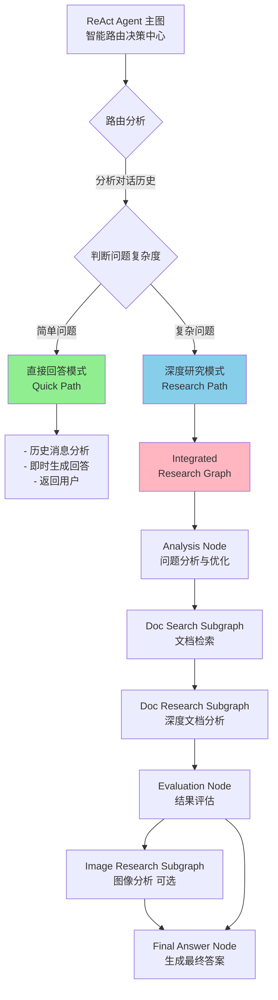
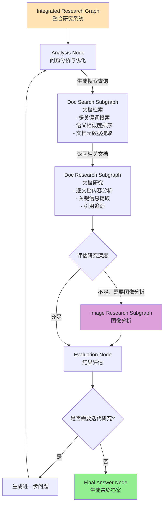

# RAGA 智能研究系统 - ReAct Agent 路由版

> 一个基于 RAG (Retrieval-Augmented Generation) 的智能研究系统，采用 ReAct Agent 智能路由架构，支持深度文档研究、图像分析和网络搜索。


## 📋 目录

- [功能特性](#功能特性)
- [系统架构](#系统架构)
- [快速开始](#快速开始)
- [项目结构](#项目结构)
- [配置指南](#配置指南)
- [使用示例](#使用示例)
- [开发指南](#开发指南)

---

## 🎯 功能特性

### 🤖 ReAct Agent 智能路由系统 (核心特性)

#### 智能问题分析
- **自动问题复杂度识别**: 系统使用 LLM 分析对话历史和用户问题
- **动态路由决策**: 根据问题类型自动选择最优处理方式
  - 🟢 **简单问题** → 直接回答模式 (即时响应)
  - 🔵 **复杂问题** → 深度研究模式 (调用 RAGA 系统)

#### 双处理模式
- **直接回答模式**: 
  - 用于对话、问候、功能说明等简单问题
  - 实时响应，无需额外研究
  - 基于对话历史的上下文理解

- **深度研究模式**:
  - 用于需要知识库支持的复杂问题
  - 多层次文档搜索和分析
  - 支持图像分析和网络搜索
  - 迭代式研究深化

### 📚 RAGA 整合研究系统 (子系统功能)

#### 文档研究子图
- **智能文档检索**: 基于语义相似度的多文档搜索
- **深度内容分析**: 逐文档内容解析和关键信息提取
- **引用追踪**: 记录文档 ID 和使用情况
- **迭代式研究**: 根据初步结果生成进一步问题

#### 图像分析子图
- **多格式支持**: 支持 JPEG、PNG、GIF、BMP、WebP 等格式
- **视觉语言模型集成**: 使用 GLM-4.5V 进行高质量图像描述
- **异步处理**: 高效的图像编码和 API 调用

#### 网络搜索子图
- **实时信息获取**: 集成 Tavily API 进行网络搜索
- **深度控制**: 支持 basic/advanced 搜索深度
- **结果过滤**: 域名过滤和结果数量控制
- **智能摘要**: 自动生成搜索结果摘要


---

## 🏗️ 系统架构

### 整体架构图



### RAGA 整合研究系统工作流



### 核心组件功能说明

| 组件 | 文件 | 功能说明 |
|------|------|---------|
| **ReAct Agent** | `react_agent.py` | 智能路由决策中心，判断直接回答或深度研究 |
| **研究系统** | `graph.py` | 整合多个子图的研究编排系统 |
| **文档搜索** | `doc_search.py` | 知识库文档检索子图 |
| **文档研究** | `doc_research.py` | 深度文档内容分析子图 |
| **图像研究** | `image_research.py` | 图像描述和分析子图 |
| **工具集** | `tools.py` | 文档管理、图像处理、网络搜索等工具 |
| **配置管理** | `config.py` | 所有 LLM、VLM、API 配置 |
| **提示词** | `prompts.py` | 系统提示词和模板 |

---

## 🚀 快速开始

### 环境要求

- Python 3.12+
- pip 或 conda
- Git

### 1️⃣ 环境准备

#### 使用 Conda (推荐)

```bash
# 创建专用环境
conda create -n RAGA python=3.12
conda activate RAGA

# 安装项目依赖
pip install -e .
```

#### 或使用 pip

```bash
# 创建虚拟环境
python3.12 -m venv venv
source venv/bin/activate  # macOS/Linux
# 或 venv\Scripts\activate  # Windows

# 安装依赖
pip install -e .
```

### 2️⃣ 配置环境变量

创建 `.env` 文件在项目根目录：

```bash
# 主 LLM 配置 (DeepSeek)
LLM_APIKEY="your-deepseek-api-key"
LLM_BASEURL="https://api.deepseek.com"
LLM_MODELNAME="deepseek-chat"

# 备用 LLM (Qwen/其他)
QWEN_LLM_APIKEY="your-qwen-api-key"
QWEN_LLM_BASEURL="your-endpoint"
QWEN_LLM_MODELNAME="Qwen-max"

# 视觉语言模型 (图像分析)
VLM_APIKEY="your-vlm-api-key"
VLM_BASEURL="https://api.example.com"
VLM_MODELNAME="glm-4.5v"

# 网络搜索
TAVILY_API_KEY="your-tavily-api-key"

# 其他配置
LANGSMITH_API_KEY="optional-tracing-key"
```

### 3️⃣ 启动服务

#### LangGraph Studio (推荐用于开发)

```bash
# 启动 LangGraph Studio (包含图可视化和调试)
langgraph dev

# 访问 http://localhost:8000
```


---

## 📁 项目结构

```
RAGA/
├── src/raga/                          # 核心系统代码
│   ├── __init__.py
│   ├── config.py                      # 配置管理 (LLM、VLM、API)
│   ├── prompts.py                     # 系统提示词模板
│   ├── tools.py                       # 公共工具函数
│   ├── react_agent.py                 # ReAct 智能路由系统 ⭐
│   ├── graph.py                       # 整合研究系统主图
│   ├── doc_search.py                  # 文档搜索子图
│   ├── doc_research.py                # 文档研究子图
│   ├── image_research.py              # 图像研究子图
│   └── page_index.py                  # 页面索引工具
│
├── data/                              # 数据存储
│   ├── output/                        # 处理后的文档
│   ├── rag_storage/                   # RAG 知识库
│   └── testdoc/                       # 测试文档
│
├── tests/                             # 测试文件
│   ├── unit_tests/
│   ├── integration_tests/
│   └── conftest.py
│
├── pyproject.toml                     # Python 项目配置
├── langgraph.json                     # LangGraph 图配置
├── Makefile                           # 开发命令
├── README.md                          # 项目文档 (本文件)
```

---

## ⚙️ 配置指南

### 1. LLM 配置

编辑 `src/raga/config.py` 配置默认模型：

```python
# DeepSeek 配置
DEEPSEEK_LLM_BASEURL = "https://api.deepseek.com"
DEEPSEEK_LLM_APIKEY = "your-api-key"
DEEPSEEK_LLM_MODELNAME = "deepseek-chat"

# 创建 LLM 实例
def create_llm(provider: str = "deepseek") -> ChatOpenAI:
    """支持的 provider: 'deepseek', 'zhisuan', 'gemini'"""
    pass
```

### 2. VLM 配置 (图像分析)

```python
# config.py
VLM_BASEURL = "https://open.bigmodel.cn/api/paas/v4/"
VLM_APIKEY = "your-api-key"
VLM_MODELNAME = "glm-4.5v"

# 支持的图片格式
SUPPORTED_IMAGE_FORMATS = ['.jpg', '.jpeg', '.png', '.gif', '.bmp', '.webp']
```

### 3. LangGraph 图配置

编辑 `langgraph.json`:

```json
{
  "dependencies": ["."],
  "graphs": {
    "raga_react_agent": "./src/raga/react_agent.py:react_agent_graph",
    "integrated_research_graph": "./src/raga/graph.py:research_graph",
    "doc_search_graph": "./src/raga/doc_search.py:graph"
  },
  "env": ".env",
  "image_distro": "wolfi"
}
```

---

## 💡 使用示例

### 示例 1: 简单对话 (直接回答模式)

```
用户: "你好，你能做什么？"

系统流程:
1. ReAct Agent 分析问题
2. 判断为简单问题 (对话类)
3. 路由到直接回答模式
4. 基于系统提示词生成回答
5. 立即返回结果

响应时间: ~1-2 秒
```

### 示例 2: 复杂研究问题 (深度研究模式)

```
用户: "纳米机器人在癌症治疗中的应用机制是什么？"

系统流程:
1. ReAct Agent 分析问题
2. 判断为研究类问题 (需要知识库)
3. 路由到深度研究模式
4. RAGA 系统开始研究:
   a. 分析问题，生成优化的搜索查询
   b. 执行文档搜索子图，找到相关文档
   c. 执行文档研究子图，深度分析文档内容
   d. 可选: 执行图像研究子图分析相关图表
   e. 评估研究深度，若不足则迭代研究
   f. 生成最终综合答案
5. 返回详细的研究结果

响应时间: ~10-30 秒 (根据研究深度)
```

### 示例 3: 图像相关问题

```
用户: "这是什么图表？请分析一下。[上传图片]"

系统流程:
1. 检测到包含图像
2. 调用 image_research_subgraph
3. VLM 分析图像内容
4. 结合文档知识进行解释
5. 返回图像分析结果
```

---

## 👨‍💻 开发指南

### 添加新的 Subgraph

1. 创建新文件 `src/raga/my_subgraph.py`
2. 定义状态 `class MySubgraphState(TypedDict)`
3. 创建节点函数
4. 组建 StateGraph 并编译
5. 在 `graph.py` 中集成

### 添加新的工具

1. 在 `src/raga/tools.py` 中添加函数
2. 使用 `@tool` 装饰器
3. 提供详细的文档字符串
4. 在相应的子图中导入使用

---

## 🔍 常见问题

### Q: 为什么某些问题没有进行深度研究？

**A**: ReAct Agent 会基于问题内容和对话历史判断是否需要研究。简单问题会直接回答以提高响应速度。如需强制研究，可以在 `react_agent.py` 中修改路由逻辑。


### Q: 可以支持哪些 LLM 提供商？

**A**: 当前支持:
- DeepSeek (推荐)
- Qwen (阿里)
- Gemini (谷歌)
- 任何兼容 OpenAI API 的模型

编辑 `config.py` 中的 `create_llm()` 函数以添加支持。

### Q: 如何调试 ReAct Agent 的路由决策？

**A**: 
1. 在 `react_agent.py` 中查看日志输出
2. 使用 `langgraph dev` 启动 Studio 可视化执行流程
3. 修改 `ROUTING_ANALYSIS_TEMPLATE` 提示词进行调试


